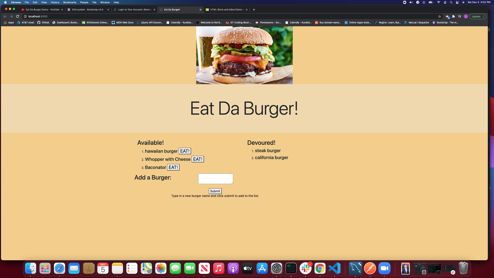

# Burger App

A fullstack web application that allows users to track burgers that available in a list and then move them to another (devoured) once they are eaten. Additionally, new burgers can be added to the 'available' list. Tech stack utilized includes: HTML, CSS, JS, JQUERY, NODE.JS, EXPRESS, MYSQL. An custom ORM is utilized to leverage the MVC design pattern for data modeling.
    
- [Installation](#installation)
- [Usage](#usage)
- [License](#license)
- [Contributions](#contributions)
- [Tests](#test)
- [Questions](#questions)
    
## Installation
    
1. Clone my github repo for this project: https://github.com/204039643/burger
2. In your CLI, navigate to the main folder where server.js is located.
3. Install, configure, and start a MySQL server instance on your local machine.
4. In MySQL workbench (or your favorite SQL server UI), execute the schema scripts to initialize dB.
5. In CLI, run 'NPM Install'.
6. Under the config folder, update lines 10-12 in connection.js to reflect your server config. (user, password, and dB name)
7. In CLI, use 'NPM start' (start script with Nodemon) to start express server.
8. In your browser, navigate to 'localhost:8080' to access app. (on your local machine).

Note: this app has been deployed to Heroku as a convenience for general users.
    
## Usage
    
1. Navigate to deployed app: https://tranquil-shore-45012.herokuapp.com/
2. To add a new burger to the 'available' list on the left, use the input field and click 'submit'.
3. To consume a burger and move it to the devoured list, click the 'Eat!' button next the burger name of interest.
    
## License
    
MIT
    
Copyright (c) [2020] Justin Sykes
    
Permission is hereby granted, free of charge, to any person obtaining a copy
of this software and associated documentation files (the "Software"), to deal
in the Software without restriction, including without limitation the rights
to use, copy, modify, merge, publish, distribute, sublicense, and/or sell
copies of the Software, and to permit persons to whom the Software is
furnished to do so, subject to the following conditions:
    
The above copyright notice and this permission notice shall be included in all
copies or substantial portions of the Software.
    
THE SOFTWARE IS PROVIDED "AS IS", WITHOUT WARRANTY OF ANY KIND, EXPRESS OR
IMPLIED, INCLUDING BUT NOT LIMITED TO THE WARRANTIES OF MERCHANTABILITY,
FITNESS FOR A PARTICULAR PURPOSE AND NONINFRINGEMENT. IN NO EVENT SHALL THE
AUTHORS OR COPYRIGHT HOLDERS BE LIABLE FOR ANY CLAIM, DAMAGES OR OTHER
LIABILITY, WHETHER IN AN ACTION OF CONTRACT, TORT OR OTHERWISE, ARISING FROM,
OUT OF OR IN CONNECTION WITH THE SOFTWARE OR THE USE OR OTHER DEALINGS IN THE
SOFTWARE.
    
## Contributions
    
- MySQL server and MySQL server workbench: (https://www.mysql.com/)
- NPM packages: MySQL (https://www.npmjs.com/package/mysql), express (https://www.npmjs.com/package/express), handlebars (https://www.npmjs.com/package/express-handlebars)
    
## Tests
    
No
    
## Questions?
Please reach out to me at either of the following:
GitHub username: 204039643
Email: atlsykes1@att.net
    
    
 ---This README was generated using nice-readme-generator :-) ---